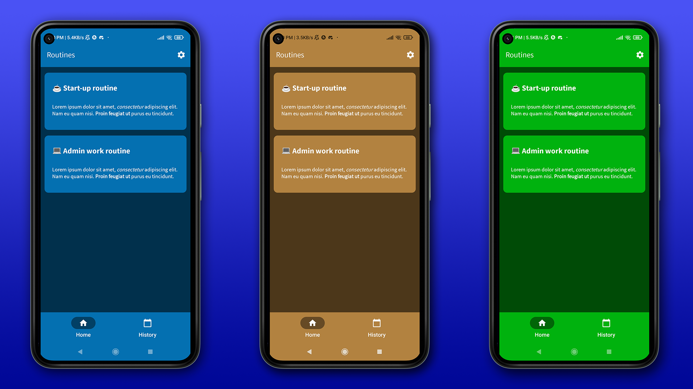
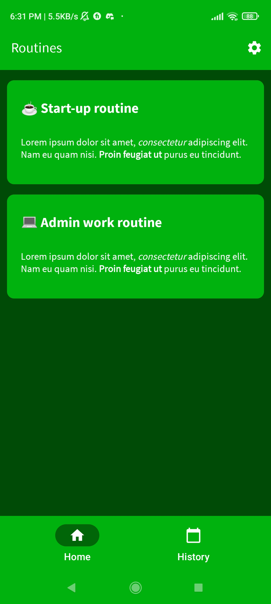
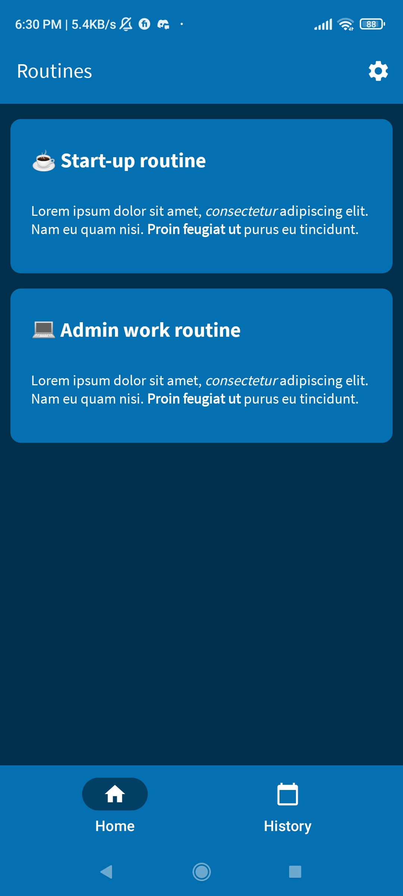
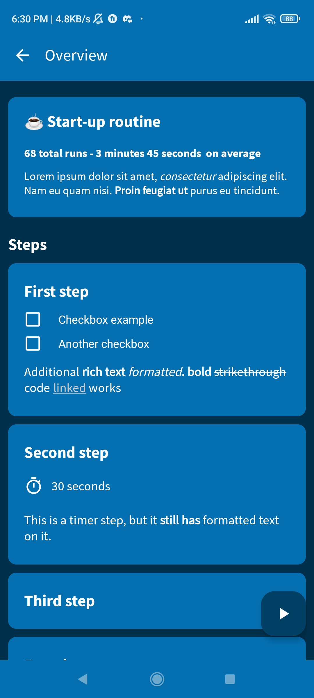
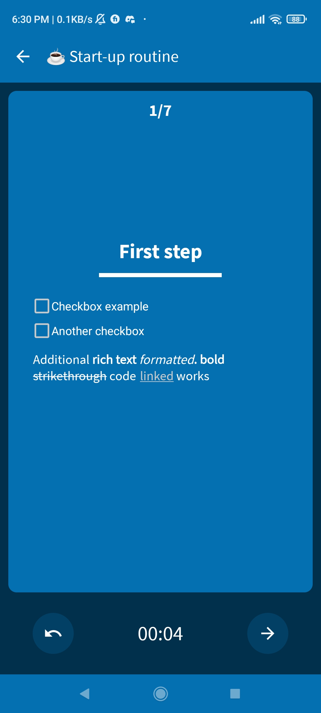
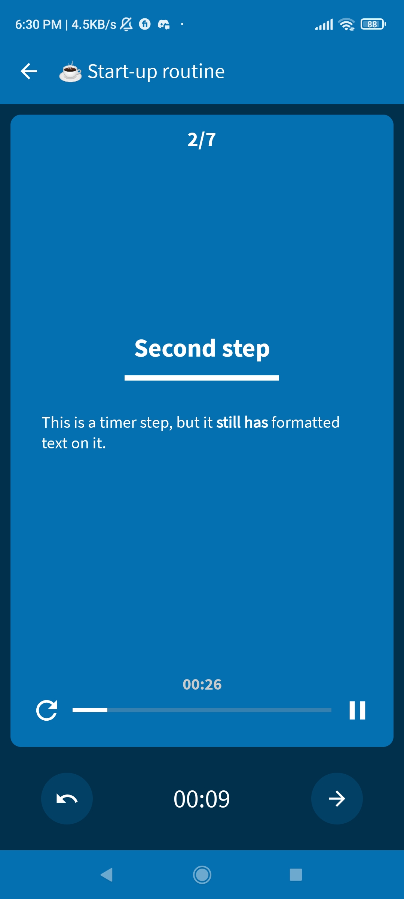
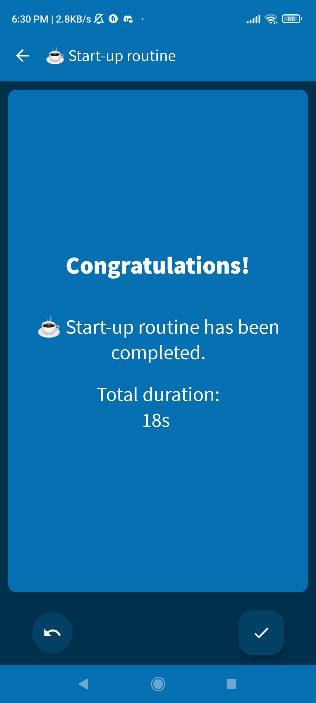
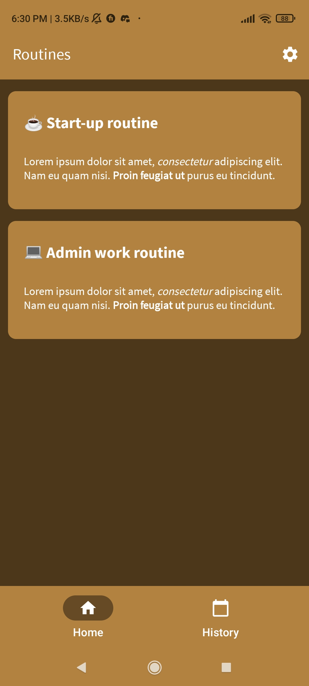

# Routines - Android app for managing Airtable to-do list 

Routines manages to-do lists created in Airtable.

### Features

- Syncs with created routines on Airtable
- Create notes, lists, and timers
- Get average times for completed tasks
- Save history to Airtable
- Set custom color themes

### Screenshots

*This is a project that I did for a client. Contact for more information about the application*
